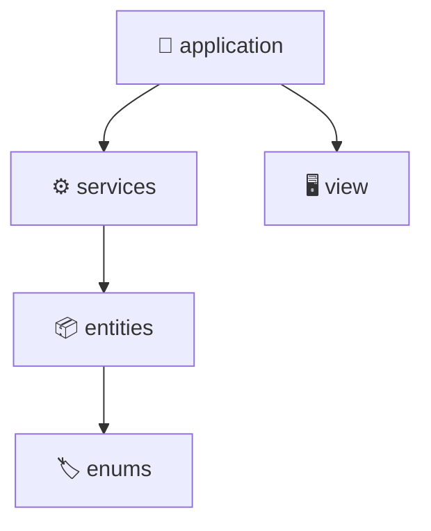

<div align="center">

# 💰 Sistema Financeiro Familiar

### Financial Management System built with Java

Projeto desenvolvido para aplicar conceitos de **Programação Orientada a Objetos**, **Arquitetura de Software** e **boas práticas de desenvolvimento**, evoluindo continuamente conforme novos conhecimentos são adquiridos.

<br>

<p>


</p>

<p>


</p>

<br>


</div>

---

## 📖 About

**Sistema Financeiro Familiar** é um projeto de longo prazo desenvolvido para consolidar conhecimentos em Java através da evolução contínua de um único sistema.

Ao invés de criar diversos projetos pequenos, a proposta é expandir continuamente esta aplicação, incorporando novos conceitos aprendidos durante a graduação e os estudos independentes, mantendo uma arquitetura organizada e escalável.

---

# ✨ Features

<div align="center">

<table>

<tr>

<td width="15%" valign="top">

## 👤 User

### ✅ Completed

- Register user
- View profile

</td>

<td width="15%" valign="top">

## 💰 Expenses

### ✅ Completed

- One-time expenses
- Recurring expenses
- Temporary expenses
- Categories
- Edit value
- Cancel expense
- Automatic updates
- History

</td>

<td width="15%" valign="top">

## 🎯 Goals

### ✅ Completed

- Create goals
- Edit value
- Progress tracking
- Remaining value
- Cancel goal
- History

</td>

<td width="15%" valign="top">

## 📊 Reports

### ✅ Completed

- Available balance
- Expense percentage
- Free income
- Financial analysis

</td>

</tr>

</table>

</div>

---

## 🚀 Current Progress

```text
██████████████████░░░░░░░░░░░░░░░░░ 60%

✔ Core System
✔ Object-Oriented Programming
✔ Financial History
✔ Automatic Expense Management

Next:
→ File Persistence
→ Database
→ Spring Boot
→ REST API
→ Web Interface
```
---

# 🏗️ Architecture



<br>

| Layer | Description |
|:------|:------------|
| 🚀 application | Starts the application and initializes the system. |
| ⚙️ services | Contains the business rules and managers. |
| 🖥️ view | Handles console interaction with the user. |
| 📦 entities | Represents the application's domain objects. |
| 🏷️ enums | Enumerations shared across the project. |

---

## 🛠 Tech Stack

<p align="center">


</p>

<p align="center">

Java 25 • Object-Oriented Programming • Layered Architecture • Git

</p>

## 🚀 Roadmap

### Current Version

✅ User Management

✅ Expense Types

✅ Financial Analysis

✅ Goals

✅ Expense History

---

### Next Version

⬜ Data Persistence

⬜ Database Integration

⬜ Spring Boot

⬜ REST API

⬜ Authentication

⬜ Dashboard

⬜ Web Interface

---

# 📈 Project Evolution

<table align="center">

<tr>
<th>Version</th>
<th>Main Evolution</th>
<th>Status</th>
</tr>

<tr>
<td><b>v0.1</b></td>
<td>Initial Java application with user, expenses and goals.</td>
<td>✅ Completed</td>
</tr>

<tr>
<td><b>v0.2</b></td>
<td>Refactoring to Object-Oriented Programming with better class organization.</td>
<td>✅ Completed</td>
</tr>

<tr>
<td><b>v0.3</b></td>
<td>Dynamic lists, menus and architecture improvements.</td>
<td>✅ Completed</td>
</tr>

<tr>
<td><b>v0.4</b></td>
<td>Expense types (One-time, Recurring and Temporary), history and automatic management.</td>
<td>✅ Current</td>
</tr>

<tr>
<td><b>v0.5</b></td>
<td>Data persistence (Files).</td>
<td>🚧 Planned</td>
</tr>

<tr>
<td><b>v0.6</b></td>
<td>Database integration.</td>
<td>📅 Planned</td>
</tr>

<tr>
<td><b>v0.7</b></td>
<td>Spring Boot + REST API.</td>
<td>📅 Planned</td>
</tr>

<tr>
<td><b>v1.0</b></td>
<td>Complete Web Application.</td>
<td>🎯 Goal</td>
</tr>

</table>

---
# 🚀 Getting Started

```bash
git clone https://github.com/ThiaggoB/sistema-financeiro-familiar.git
```

Open the project in **IntelliJ IDEA** and run:

```
application.Main
```
# 👨‍💻 Author

Thiaggo Bueno

Software Engineering Student

Backend Java Developer

GitHub:
https://github.com/ThiaggoB

Linkedin: 
https://www.linkedin.com/in/thiaggo-bueno-94b57a38a/

Gmail: 
thiaggobueno.dev@gmail.com

This project grows alongside my Software Engineering journey. Every new concept learned is reflected in the codebase.
