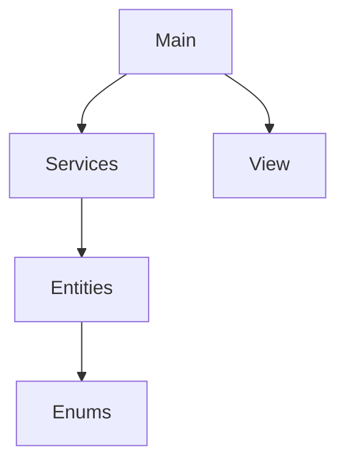

<h2 align="center">💰 Sistema Financeiro Familiar</h2>

Backend Java Project • Financial Management System

  
  
  

<table>
<tr>
<td width="25%">

### 👤 Usuário

- ✔ Cadastro
- ✔ Perfil

</td>

<td width="25%">

### 💰 Despesas

- ✔ Única
- ✔ Recorrente
- ✔ Temporária
- ✔ Histórico

</td>

<td width="25%">

### 🎯 Metas

- ✔ Cadastro
- ✔ Progresso
- ✔ Histórico

</td>

<td width="25%">

### 📊 Relatórios

- ✔ Saldo
- ✔ Percentuais
- ✔ Análises

</td>
</tr>
</table>

## 🚀 Roadmap

- [x] Cadastro de usuários
- [x] Metas financeiras
- [x] Histórico
- [x] Polimorfismo
- [x] Arquitetura em camadas
- [ ] Persistência em arquivos
- [ ] Banco de dados
- [ ] Spring Boot
- [ ] API REST
- [ ] Interface Web
